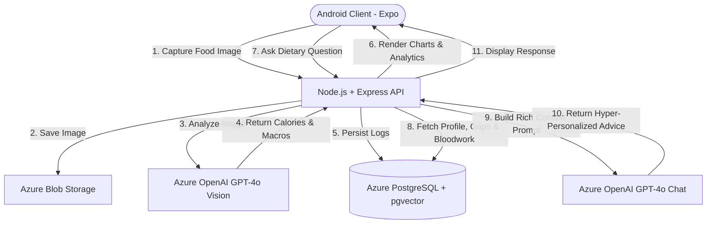

# MealMentor AI: End-to-End System Implementation Flow

This document outlines the step-by-step sequence required to build the entire **MealMentor AI** system from scratch. It is divided into 7 distinct phases, progressing from environment setup and database initialization to backend/frontend development, AI pipeline integration, and Azure deployment.

---

## 1. High-Level System Architecture & Flow

Before building, verify the data flow and system tiers:



---

## Phase 1: Infrastructure & Environment Setup

### Step 1.1: Provision Azure Cloud Services
1. Log in to the Azure Portal.
2. Create a Resource Group (e.g., `rg-mealmentor-prod`).
3. Provision the following services:
   *   **Azure Database for PostgreSQL (Flexible Server)**: B1ms tier is sufficient for development. Ensure PostgreSQL version 15+ and enable the `pgvector` extension.
   *   **Azure Blob Storage**: Create containers `food-images` and `health-reports`. Enable anonymous read access for blob items if direct URLs are needed in the app, or use SAS tokens.
   *   **Azure OpenAI Service**: Deploy models `gpt-4o` (version 2024-05-13 or newer) and `text-embedding-ada-002` (for vector matching).
   *   **Azure App Service**: Create a Node.js 20 LTS Linux runtime plan.

### Step 1.2: Set Up Local Development Environment
1. Install **Node.js 20 LTS**, **Git**, and **PostgreSQL CLI (psql)** or PgAdmin.
2. Install **Expo CLI** globally:
   ```bash
   npm install -g expo-cli
   ```
3. Initialize the directory structure:
   ```
   mealmentor-ai/
   ├── backend/
   └── frontend/
   ```

---

## Phase 2: Database Design & Initialization

### Step 2.1: Connect to Azure PostgreSQL and Enable Extensions
Connect to your database via terminal or PgAdmin and run:
```sql
CREATE EXTENSION IF NOT EXISTS vector;
CREATE EXTENSION IF NOT EXISTS "uuid-ossp";
```

### Step 2.2: Execute Database Schema Creation
Run the following SQL script to create the required tables:

```sql
-- 1. Users Table
CREATE TABLE users (
    id UUID PRIMARY KEY DEFAULT uuid_generate_v4(),
    email VARCHAR(255) UNIQUE NOT NULL,
    password_hash VARCHAR(255) NOT NULL,
    age INT,
    height NUMERIC(5,2), -- in cm
    weight NUMERIC(5,2), -- in kg
    goals VARCHAR(50), -- 'weight_loss', 'muscle_gain', 'maintenance'
    dietary_preferences VARCHAR(100)[], -- ['vegetarian', 'lactose_free']
    allergies VARCHAR(100)[], -- ['nuts', 'shellfish']
    health_conditions VARCHAR(100)[], -- ['diabetes', 'hypertension']
    profile_embedding vector(1536), -- user profile embedding for similarity search
    created_at TIMESTAMP DEFAULT CURRENT_TIMESTAMP
);

-- 2. Meals Table
CREATE TABLE meals (
    id UUID PRIMARY KEY DEFAULT uuid_generate_v4(),
    user_id UUID REFERENCES users(id) ON DELETE CASCADE,
    meal_type VARCHAR(50) NOT NULL, -- 'breakfast', 'lunch', 'dinner', 'snack'
    name VARCHAR(255) NOT NULL,
    image_url TEXT,
    logged_at TIMESTAMP DEFAULT CURRENT_TIMESTAMP
);

-- 3. Nutrition Entries Table (Portion & micro/macro details per food item in a meal)
CREATE TABLE nutrition_entries (
    id UUID PRIMARY KEY DEFAULT uuid_generate_v4(),
    meal_id UUID REFERENCES meals(id) ON DELETE CASCADE,
    food_name VARCHAR(255) NOT NULL,
    calories INT NOT NULL,
    protein NUMERIC(5,2) NOT NULL,
    carbs NUMERIC(5,2) NOT NULL,
    fat NUMERIC(5,2) NOT NULL,
    vitamins JSONB DEFAULT '{}', -- {'vitamin_c_mg': 12, 'vitamin_d_mcg': 2}
    minerals JSONB DEFAULT '{}', -- {'iron_mg': 1.5, 'calcium_mg': 120}
    created_at TIMESTAMP DEFAULT CURRENT_TIMESTAMP
);

-- 4. Health Reports Table
CREATE TABLE health_reports (
    id UUID PRIMARY KEY DEFAULT uuid_generate_v4(),
    user_id UUID REFERENCES users(id) ON DELETE CASCADE,
    report_name VARCHAR(255),
    file_url TEXT NOT NULL,
    parsed_data JSONB DEFAULT '{}', -- {'sugar_fasting': 95, 'cholesterol': 190}
    uploaded_at TIMESTAMP DEFAULT CURRENT_TIMESTAMP
);

-- 5. Chat Messages Table
CREATE TABLE chat_messages (
    id UUID PRIMARY KEY DEFAULT uuid_generate_v4(),
    user_id UUID REFERENCES users(id) ON DELETE CASCADE,
    role VARCHAR(20) NOT NULL, -- 'user', 'assistant', 'system'
    content TEXT NOT NULL,
    created_at TIMESTAMP DEFAULT CURRENT_TIMESTAMP
);

-- 6. Daily Summaries Table (Pre-calculated daily sums for fast chart rendering)
CREATE TABLE daily_summaries (
    id UUID PRIMARY KEY DEFAULT uuid_generate_v4(),
    user_id UUID REFERENCES users(id) ON DELETE CASCADE,
    date DATE NOT NULL,
    total_calories INT NOT NULL,
    total_protein NUMERIC(6,2) NOT NULL,
    total_carbs NUMERIC(6,2) NOT NULL,
    total_fat NUMERIC(6,2) NOT NULL,
    UNIQUE(user_id, date)
);
```

---

## Phase 3: Backend Setup & API Development

### Step 3.1: Initialize Express Backend
In the `backend/` directory, initialize npm and install dependencies:
```bash
npm init -y
npm install express pg dotenv jsonwebtoken bcryptjs multer azure-storage @azure/openai cors
```

### Step 3.2: Configure Environment Variables (`backend/.env`)
Create a `.env` file in the backend root:
```env
PORT=5000
DB_USER=your_postgres_user
DB_HOST=your_azure_postgres_server.postgres.database.azure.com
DB_NAME=mealmentor
DB_PASSWORD=your_password
DB_PORT=5432
JWT_SECRET=your_jwt_signing_key
AZURE_STORAGE_CONNECTION_STRING=your_blob_storage_connection_string
AZURE_OPENAI_ENDPOINT=https://your-endpoint.openai.azure.com/
AZURE_OPENAI_API_KEY=your_azure_openai_key
```

### Step 3.3: Build Core Modules
1.  **Database Connection (`db.js`)**: Establish connection pool using `pg`.
2.  **JWT Authentication Middleware (`auth.js`)**: Guard routes by reading and verifying the `Authorization` header token.
3.  **Blob Upload Helper (`upload.js`)**: Configure `multer` and `@azure/storage-blob` to upload multipart form data directly to Azure Blob containers.

### Step 3.4: Define REST API Routes
Implement basic controllers and attach to express:
*   `POST /api/auth/register` & `POST /api/auth/login` (Auth pipeline).
*   `PUT /api/user/profile` & `GET /api/user/profile` (Update metrics and medical attributes).
*   `POST /api/meals` (Multipart upload: photo + metadata -> Blob Storage -> triggers Vision analyze API -> saves to `meals` + `nutrition_entries` + aggregates to `daily_summaries`).
*   `GET /api/meals/history` (Returns logs by calendar dates).
*   `GET /api/analytics` (Aggregates calorie and macro trend lines for daily, weekly, monthly views).

---

## Phase 4: Frontend Development (React Native & Expo)

### Step 4.1: Create Mobile App Template
In the `frontend/` directory, run:
```bash
npx create-expo-app@latest ./ --template blank
npx expo install react-navigation react-native-svg expo-camera expo-image-picker react-native-chart-kit @react-native-async-storage/async-storage
```

### Step 4.2: Build Navigation Hierarchy
Set up a Tab Navigation system nested inside an Authentication Stack:
```
NavigationContainer
 ├── AuthStack (Login, Register, ProfileSetup)
 └── AppTab (Dashboard, Camera/Log, AI Chat, Health Reports, Profile)
```

### Step 4.3: Implement UI Layout & Screens
Develop screens using high-fidelity Vanilla styling:
1.  **Dashboard Screen**: Radial progress indicators for calories, carbs, proteins, fats using `react-native-svg`.
2.  **Meal Camera Screen**: Utilizes `expo-camera` to snap food photos and sends them to the backend API.
3.  **AI Dietitian Chat Screen**: Bubble layouts showing user and assistant chats using `react-native-gifted-chat` style elements.
4.  **Health Reports Screen**: Upload medical PDF/images to the parsing backend.
5.  **Analytics Screen**: Line graphs and radar charts representing nutrition using `react-native-chart-kit`.

---

## Phase 5: Core AI Pipelines & Integration

### Step 5.1: GPT-4o Vision Food Analysis Pipeline
Implement this method on your Node.js backend. It takes a food image URL and prompts GPT-4o Vision to return structured nutrition JSON.

```javascript
// System Prompt for GPT-4o Vision
const FOOD_VISION_PROMPT = `
You are an expert nutritional scientist. Analyze the provided food image.
Identify all visible food items, estimate their portion sizes (in grams), and calculate their key nutritional values.
Respond ONLY with a valid JSON object matching this schema. Do not include any markdown or codeblock wrappers:
{
  "meal_name": "Short summary of the overall meal",
  "items": [
    {
      "food_name": "Name of food item",
      "portion_size_g": 150,
      "calories": 250,
      "protein": 12.5,
      "carbs": 30.0,
      "fat": 8.2,
      "vitamins": {
        "vitamin_c_mg": 15.0
      },
      "minerals": {
        "calcium_mg": 50.0
      }
    }
  ]
}
`;
```

*Backend Logic:* Use the `@azure/openai` SDK to call Chat Completions with the image URL or Base64 payload, specifying the vision model and injecting the prompt as user message along with the image.

---

### Step 5.2: AI Dietitian Context builder
When the user chats with the AI Dietitian, compile the following database details into the GPT-4o system prompt:

```javascript
async function compileChatContext(userId) {
  // 1. Fetch user data (goals, conditions, dietary profile)
  // 2. Fetch today's accumulated daily totals from daily_summaries
  // 3. Fetch parsed medical markers from health_reports
  // 4. Calculate targets (e.g. using Mifflin-St Jeor equation) and remaining budget
  
  return `
You are "MealMentor AI Dietitian", a clinical dietitian assistant.
The user is a ${age}-year-old with goals: ${goals}.
Medical Conditions: ${healthConditions.join(', ') || 'None'}.
Allergies: ${allergies.join(', ') || 'None'}.
Dietary Preferences: ${dietaryPreferences.join(', ') || 'None'}.

Today's Nutritional Stats:
- Calories consumed: ${consumedCalories} kcal / Target: ${targetCalories} kcal
- Protein: ${consumedProtein}g / Target: ${targetProtein}g
- Carbs: ${consumedCarbs}g / Target: ${targetCarbs}g
- Fat: ${consumedFat}g / Target: ${targetFat}g

Latest Medical Lab Markers:
${JSON.stringify(healthMarkers)}

Provide hyper-personalized, clinical-grade suggestions. If the user asks for suggestions, respect their targets, allergies, and today's remaining budgets. Keep advice actionable.
`;
}
```

---

### Step 5.3: Medical Lab Report Parser
To parse lab report PDFs or images:
1. Upload report to Blob Storage.
2. Send report URL (or raw bytes) to GPT-4o.
3. Prompt:
   ```
   Extract clinical lab markers from this medical health report. Identify critical values such as fasting blood sugar, LDL/HDL cholesterol, HbA1c, Vitamin D, Vitamin B12, and Thyroid markers. Respond ONLY in a JSON mapping: {"marker_name": value}.
   ```
4. Save the resulting JSON structure into `health_reports.parsed_data` for context assembly.

---

## Phase 6: Features Implementation & Integration

### Step 6.1: Connect Frontend to backend API
Set up API clients using `fetch` or `axios` in React Native:
*   Configure auth interceptors to attach the JWT token dynamically.
*   Implement state updates on the dashboard to fetch updated radial charts after a meal is logged.

### Step 6.2: Implement Sync & Daily Summaries Trigger
Create a database trigger or backend service logic:
*   Every time a row is inserted/updated in `nutrition_entries`, recalculate the sums for the matching `user_id` and `date`.
*   Upsert these values into `daily_summaries` to keep analytics screens instantaneous.

---

## Phase 7: Deployment & CI/CD on Azure

### Step 7.1: Configure Azure Database Firewall
1. Navigate to the Azure PostgreSQL resource.
2. Enable "Allow public access from any Azure service within Azure to this server" to allow App Service to access the database.

### Step 7.2: Deploy backend to Azure App Service
1. Create a deployment script or configure GitHub Actions.
2. Ensure you add all backend environment variables (`DB_HOST`, `JWT_SECRET`, etc.) to the **Configuration Settings** of the Azure App Service.
3. Set the startup command:
   ```bash
   node index.js
   ```

### Step 7.3: Build Android APK
1. Install EAS CLI: `npm install -g eas-cli`
2. Run `eas build:configure` in the `frontend/` directory.
3. Create production APK for testing:
   ```bash
   eas build --platform android --profile preview
   ```
4. Download the generated APK onto your Android device to run the completed system.
